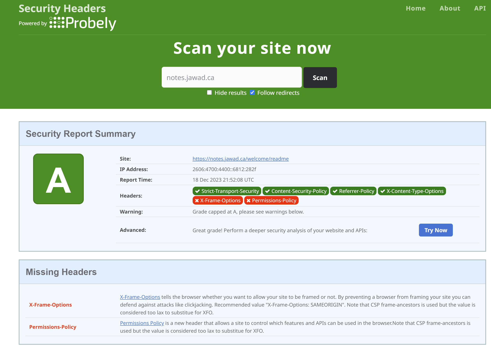

---
layout:
  title:
    visible: true
  description:
    visible: false
  tableOfContents:
    visible: true
  outline:
    visible: true
  pagination:
    visible: true
---

# Security Headers

#### [SecurityHeaders.com](security-headers.md#securityheaders.com-is-a-web-based-tool-that-analyzes-http-response-headers-for-a-given-website-eval) is a web-based tool that analyzes HTTP response headers for a given website, evaluating its security posture.

**Key Features:**

* Evaluate HTTP Security Headers
* Identify Missing or Misconfigured Headers
* Provide Security Recommendations

**Example:**

<figure><figcaption></figcaption></figure>
