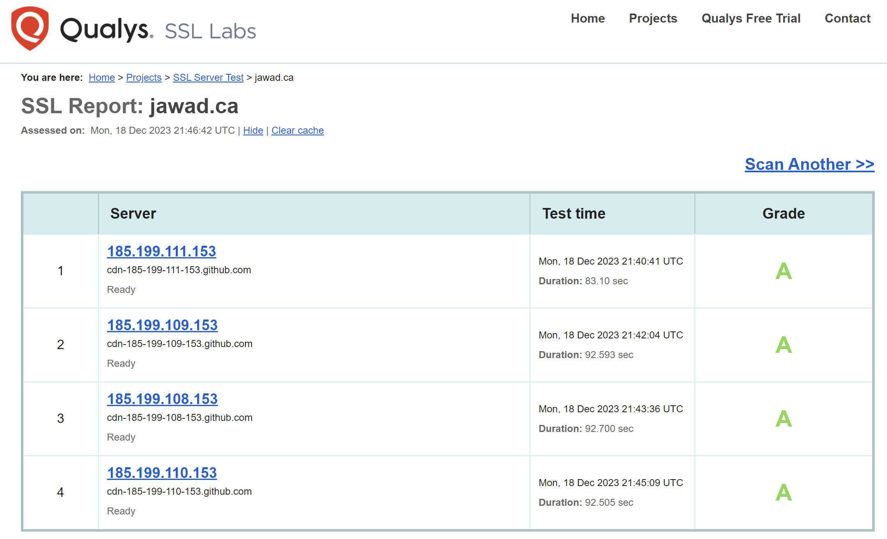

---
layout:
  title:
    visible: true
  description:
    visible: false
  tableOfContents:
    visible: true
  outline:
    visible: true
  pagination:
    visible: true
---

# Qualys SSL Server Test

SSL Server Test by Qualys SSL Labs is [an online tool](https://www.ssllabs.com/ssltest/index.html) that assesses the SSL/TLS configuration of a web server, providing a detailed security analysis.

**Key Features:**

* Evaluate SSL/TLS Configuration
* Identify Vulnerabilities and Weaknesses
* Provide Detailed Security Grading

**Example:**

<figure><figcaption></figcaption></figure>

