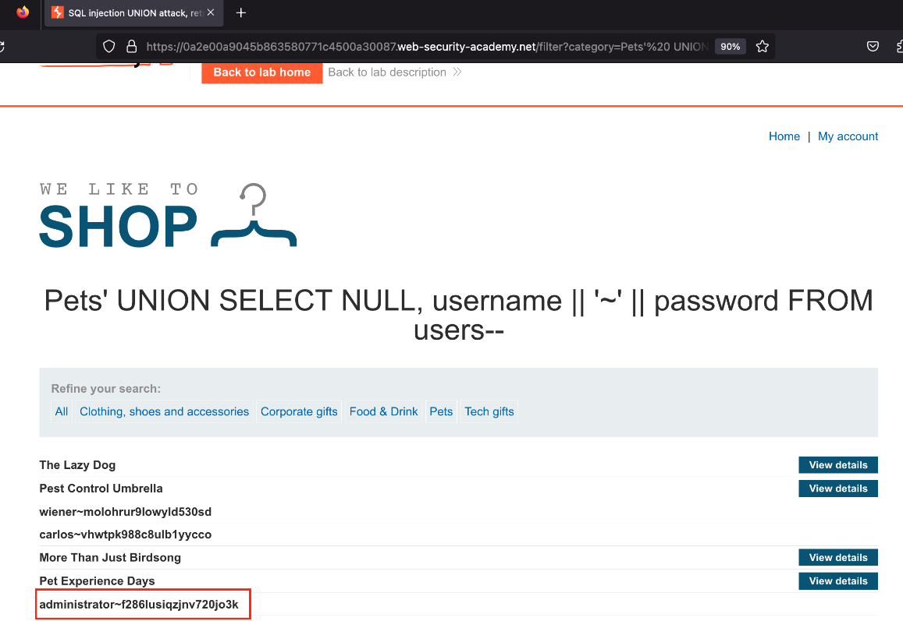

---
layout:
  title:
    visible: true
  description:
    visible: false
  tableOfContents:
    visible: true
  outline:
    visible: true
  pagination:
    visible: true
---

# Enhancing Your MacOS Terminal Experience

## Enhancing Your MacOS Terminal Experience with iTerm2

Elevate your terminal experience on MacOS by following this quick tutorial on installing iTerm2 and applying a custom color scheme. This will not only improve the aesthetics of your terminal but also potentially make it easier to read and work with.

### Step 1: Install Homebrew

[Homebrew](https://brew.sh) is a package manager for MacOS that simplifies the process of installing software on MacOS. Run the following command in your terminal to install Homebrew:

```shell
/bin/bash -c "$(curl -fsSL https://raw.githubusercontent.com/Homebrew/install/master/install.sh)"
```


### Step 2: Install iTerm2

With Homebrew installed, you can easily install [iTerm2](https://iterm2.com/) by running:

```shell
brew install --cask iterm2
```


### Step 3: Download and Apply iTerm2 Color Scheme

1. Choose your desired iTerm2 color scheme from [iTerm2 Color Schemes](https://iterm2colorschemes.com/).
2. Download the theme file and save it using the following extension: `.itermcolors`.

#### Applying the Color Scheme:

1. Open iTerm2.
2. Go to iTerm > Preferences > Profiles > Colors tab.
3. Click on Color Presets... at the bottom right > Import...
4. Select your downloaded `.itermcolors` file.
5. Once imported, select it from the list of Color Presets.

<figure><figcaption></figcaption></figure>

### **Step 4: Install Oh My Zsh**

using the following command:

```sh
sh -c "$(curl -fsSL https://raw.githubusercontent.com/ohmyzsh/ohmyzsh/master/tools/install.sh)"
```

### **Step 5: Install Syntax Highlighting and Auto-Suggestions Plugins**

1. **Syntax Highlighting**:

```sh
git clone https://github.com/zsh-users/zsh-syntax-highlighting.git ${ZSH_CUSTOM:-$HOME/.oh-my-zsh/custom}/plugins/zsh-syntax-highlighting
```

2. **Auto-Suggestions**:

```sh
git clone https://github.com/zsh-users/zsh-autosuggestions ${ZSH_CUSTOM:-$HOME/.oh-my-zsh/custom}/plugins/zsh-autosuggestions
```

After cloning, add `zsh-syntax-highlighting` and `zsh-autosuggestions` to the `plugins` section in `~/.zshrc`.

### **Step 6: Install and Configure the Powerlevel10k Theme**

1. Clone the Powerlevel10k repository:

```sh
git clone --depth=1 https://github.com/romkatv/powerlevel10k.git ${ZSH_CUSTOM:-$HOME/.oh-my-zsh/custom}/themes/powerlevel10k
```

2. Update the `ZSH_THEME` line in your `~/.zshrc` file to use Powerlevel10k:

```
ZSH_THEME="powerlevel10k/powerlevel10k"
```

3. Apply the changes by sourcing `~/.zshrc`:

```sh
source ~/.zshrc
```

### **Step 7: Install a Nerd Font**

To fully enjoy Powerlevel10k, you'll need a Nerd Font. Choose and download your preferred Nerd Font from [Nerd Fonts](https://www.nerdfonts.com/font-downloads). Install the font on your system and set your terminal to use it.


```bash
git clone https://github.com/zsh-users/zsh-syntax-highlighting.git
echo "source ${(q-)PWD}/zsh-syntax-highlighting/zsh-syntax-highlighting.zsh" >> ${ZDOTDIR:-$HOME}/.zshrc
```



```bash
git clone https://github.com/zsh-users/zsh-autosuggestions ${ZSH_CUSTOM:-~/.oh-my-zsh/custom}/plugins/zsh-autosuggestions
```


Add the new plugins to the `~/.zshrc` file, locate the `plugins=` line and append your new plugin to the existing list:

```sh
plugins=(git zsh-syntax-highlighting zsh-autosuggestions)
```


### Step 8: Beautifying the `ls` Command with `colorls` Ruby gem

**Install `colorls`**:

```sh
sudo gem install colorls
```

To avoid typing `colorls` every time, we'll create an alias in the `.zshrc` file. This will allow us to use `ls` as a substitute command. Open `~/.zshrc` and add:

```sh
alias ls='colorls'
```

**Apply Changes**: For the alias to take effect, source your `.zshrc` file by running:

```sh
source ~/.zshrc
```


Et voilà!&#x20;

<figure><figcaption></figcaption></figure>

Reference:



